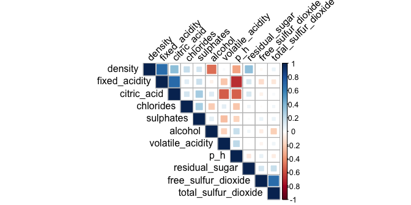
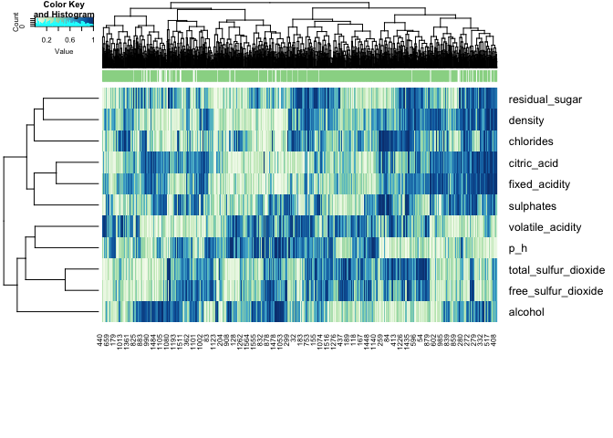
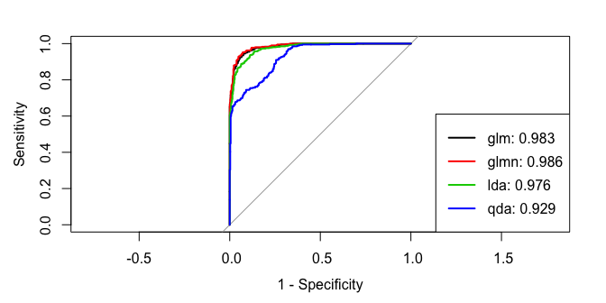
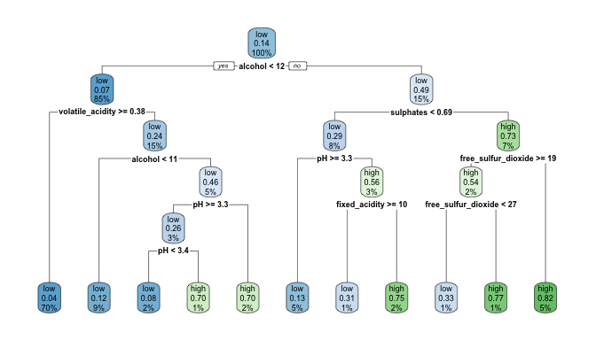
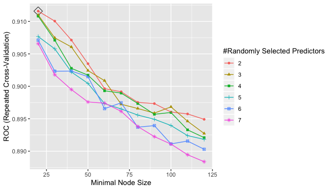
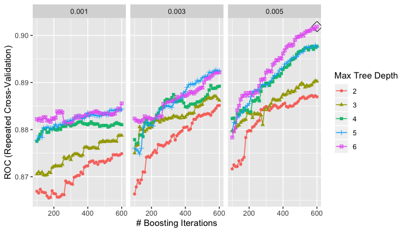
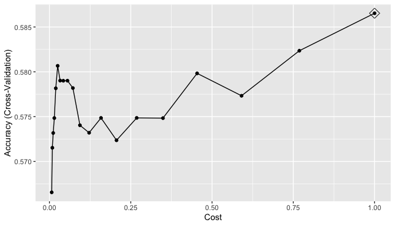
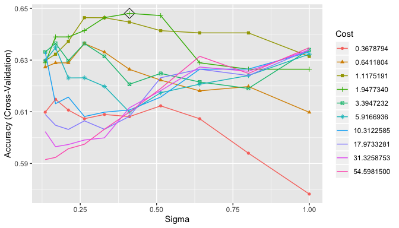

P8106 Final Report
================
Xin He, Ziqi Zhou, Ziyi Zhao
5/13/2020

# Introduction

Once viewed as a luxury good, nowadays red wine is increasingly enjoyed
by a wider range of consumers, including our teammates. We noticed that
the price and quality of differnet brands of red wine differ. We are
interested in investigating what chemical elements of red wine are
related to its quality.

We focused on a dataset named “Red Wine Quality”, which is related to
the Portuguese “Vinho Verde” wine. It includes information about
different chemical elements of red wine and its quality score. The
dataset is composed of 12 variables and 1599 observations. There is no
missing data in our dataset. Among the 12 variables, we chose “quality”
as our outome variable and the other 11 variables as predict variables.
The outcome variable “quality” is based on sensory data and scored
between 0 and 10. High quality was defined as the quality score ≥ 6.5.
Low quality was defined as quality score \< 6.5. The 11 predict
variables are fixed acidity, volatile acidity, citric acid, residual
sugar, chlorides, free sulfur dioxide, total sulfur dioxide, density,
pH, sulphates and alcohol.

We are trying to build different models to answer the question that what
is the relationship between 11 chemical elements of red wine and the
quality score of red wine. We seperated the full dataset into a train
dataset and a test dataset. The train dataset includes 1200
observations. The test dataset includes 399
observations.

# Exploratory analysis/visualization

## Correlation plot

In the correlation plot, the blue means that two variables are
positively correlated; the red means that two variable are negatively
correlated. The darker they are, more correlated they are. We could find
in this plot that the fixed acidity and citric acidity are highly
positive correlated. Fixed acidity is highly positive correlated with
density. Volatile\_acidity is negative correlated with fixed acidity and
citric acidity. What’s more the pH is negative correlated with fixed
acidity and citric acidity. It is easy to interpret since the pH is
describes how acidic or basic a wine is. The factors might influence
each other
somehow.

## Cluster analysis (heatmap)

We got a plot with more variation in color. From the dendrogram at top
and heatmap below, we can see “good” wines always have relatively high
rank of alcohol, citric acid, fixed acidity, and sulphate. Wines with
high percentile of sulfur dioxide and volatile acidity may not be
considered as “good” wines. The patterns of residual sugar, density, and
chlorides are not very clear, because some “good” wines have high
percentile but he others have relatatively smaller percentile.

# Models

## Logistic regression

We fit the training data with logistic, regularized logistic, linear
discriminant analysis (LDA), and quadratic discriminant analysis
(QDA).

From the summary and graph above, we can find out that the logistics and
regularized logistic regression model has better ROC curves and AUC
values.

## Classification tree

**Variable importance**

In this model, the variable importance alcohol \> sulphates \> density
\> volatile acidity \> total sulfur dioxide \> chlorides \> fixed
acidity \> citric acid \> residual sugar \> pH \> free sulfur dioxide.
Alcohol is the most important variable when predicting red wine
quality.

## Random forests

## Boosting

## Linear Kernel

# Radial Kernel

# Conclusions

Alcohol is the most important variable when predicting red wine quality.
The logistic regression and regularized logistic regression model has
better ROC curves and AUC values, comparing to linear discriminant
analysis and quadratic discriminant analysis. Classification tree,
random forest and boosting are not good models for the red wine quality
data. Linear kernal and radial kernel are more appropriate than
classification tree for this data.
