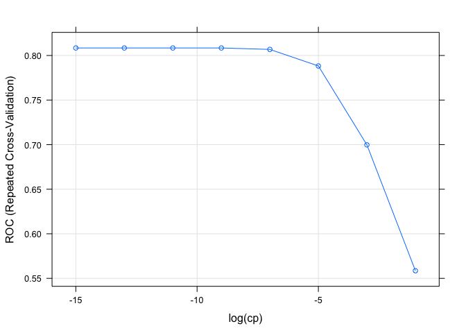
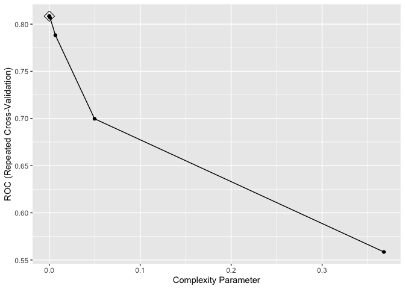
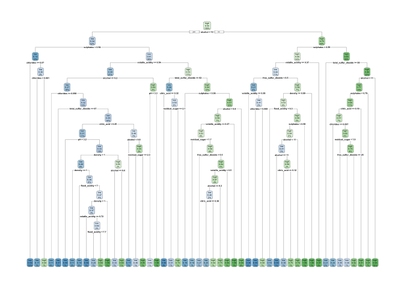
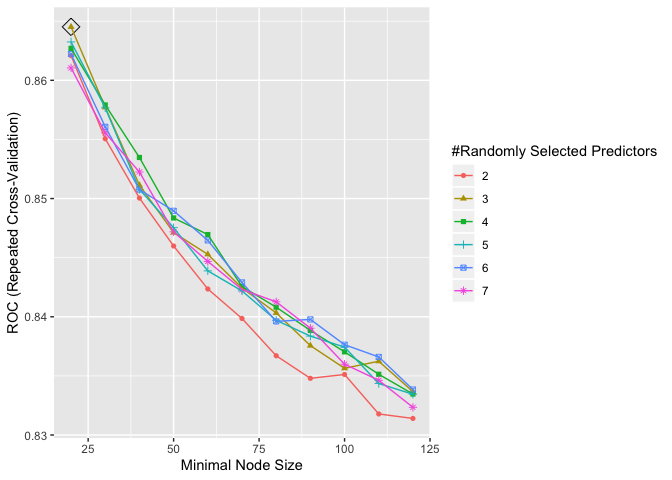
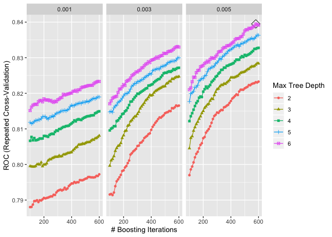

P8106\_final\_xh2395
================
Xin He
5/10/2020

## Import the data

``` r
wine_df = read_csv("./data/winequality_red.csv")
```

    ## Parsed with column specification:
    ## cols(
    ##   `fixed acidity` = col_double(),
    ##   `volatile acidity` = col_double(),
    ##   `citric acid` = col_double(),
    ##   `residual sugar` = col_double(),
    ##   chlorides = col_double(),
    ##   `free sulfur dioxide` = col_double(),
    ##   `total sulfur dioxide` = col_double(),
    ##   density = col_double(),
    ##   pH = col_double(),
    ##   sulphates = col_double(),
    ##   alcohol = col_double(),
    ##   quality = col_double()
    ## )

``` r
wine_df = wine_df %>%
  mutate(quality = ifelse(quality %in% c(3,4,5), "low", "high")) %>% 
  rename(fixed_acidity = `fixed acidity`,
         volatile_acidity = `volatile acidity`,
         citric_acid = `citric acid`,
         residual_sugar =`residual sugar`,
         free_sulfur_dioxide = `free sulfur dioxide`,
         total_sulfur_dioxide =`total sulfur dioxide`)
```

## Set train data and test data

``` r
trRows = createDataPartition(wine_df$quality, p = .75, list = F)

train_df = wine_df[trRows,]

test_df = wine_df[-trRows,]
```

``` r
train_df$quality = factor(train_df$quality, c("low", "high"))
```

## Fit a classification tree to the training data

``` r
set.seed(2020)

ctrl = trainControl(method = "repeatedcv",
                    summaryFunction = twoClassSummary,
                    classProbs = TRUE)

tree_fit = train(quality~.,
                 data = train_df,
                 method = "rpart",
                 tuneGrid = data.frame(cp = exp(seq(-15, 0, by = 2))),
                 trControl = ctrl,
                 metric = "ROC"
                 )
```

## summary

``` r
tree_fit$bestTune
```

    ##             cp
    ## 4 0.0001234098

``` r
tree_fit$finalModel$cptable
```

    ##             CP nsplit rel error
    ## 1  0.365591398      0 1.0000000
    ## 2  0.024492234      1 0.6344086
    ## 3  0.015531661      4 0.5609319
    ## 4  0.014336918      8 0.4910394
    ## 5  0.010752688      9 0.4767025
    ## 6  0.006272401     10 0.4659498
    ## 7  0.004480287     16 0.4265233
    ## 8  0.004181601     18 0.4175627
    ## 9  0.004032258     22 0.3960573
    ## 10 0.003584229     27 0.3709677
    ## 11 0.003136201     31 0.3566308
    ## 12 0.002688172     44 0.3064516
    ## 13 0.001792115     46 0.3010753
    ## 14 0.000000000     49 0.2956989

## plot

``` r
plot(tree_fit, xTrans = function(x)log(x), xlab = "log(cp)")
```

<!-- -->

``` r
ggplot(tree_fit, highlight = T)
```

<!-- -->

``` r
rpart.plot(tree_fit$finalModel)
```

<!-- -->

## Predict the response on the test data

``` r
tree.pred = predict(tree_fit, newdata = test_df, type = "raw")
1 - sum(tree.pred == test_df$quality) / length(test_df$quality)
```

    ## [1] 0.3007519

27.31%

## Random forests

``` r
set.seed(2020)

rf.grid = expand.grid(mtry = 2:7,
                      splitrule = "gini",
                      min.node.size = seq(20, 120, by = 10))

rf_fit = train(quality~.,
                 data = train_df,
                 method = "ranger",
                 tuneGrid = rf.grid,
                 metric = "ROC",
                 trControl = ctrl,
                 importance = "impurity")
```

## Plot

``` r
ggplot(rf_fit, highlight = T)
```

<!-- -->

## Predict the response on the test data

``` r
rf.pred = predict(rf_fit, newdata = test_df, type = "raw")

1 - sum(rf.pred == test_df$quality) / length(test_df$quality)
```

    ## [1] 0.1729323

20.30%

## Boosting

``` r
set.seed(2020)

gbm.grid = expand.grid(n.trees = seq(100, 600, by = 10),
                       interaction.depth = 2:6,
                       shrinkage = c(0.001, 0.003, 0.005),
                       n.minobsinnode = 1)

gbm_fit = train(quality~.,
                data = train_df,
                method = "gbm",
                trControl = ctrl,
                distribution = "bernoulli",
                metric = "ROC",
                tuneGrid = gbm.grid,
                verbose = F
                )
```

## Plot

``` r
ggplot(gbm_fit, highlight = T)
```

<!-- -->

## Predict the response on the test data

``` r
gbm.pred = predict(gbm_fit, newdata = test_df, type = "raw")

1 - sum(gbm.pred == test_df$quality) / length(test_df$quality)
```

    ## [1] 0.2155388

25.06%
